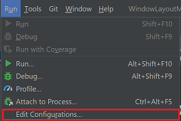
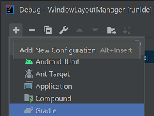
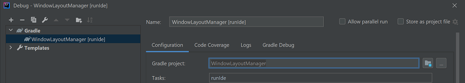

# Developer Setup
The following instructions will show you how to set up your development environment to start developing the plugin.
Thank you for your interest in the further development of this plugin. Have fun tinkering around and don't be afraid to make a pull request for your cool extensions.


## Setup your Environment

### Download IDE
When it comes to the Java development, the IntelliJ IDE is a good fit. The community version is free and can be downloaded from [here](https://www.jetbrains.com/de-de/idea/download/#section=windows).

### Installing Java
For the development of Java, the JDK (or Open JDK) is required, which can be downloaded either from [Oracle](https://www.oracle.com/ch-de/java/technologies/javase-downloads.html) or the [Open JDK Website](https://openjdk.java.net/). For this repository, Java 8 is the minimum.
If you have already installed a java development kit (JDK), ensure that the JAVA_HOME environment variable is set and points to the path where the JDK is installed. A step-by-step instruction can be found [here](https://javatutorial.net/set-java-home-windows-10).
<
## Download the code
First of all, you need a GitHub account If you don't have any yet. Afterward you can fork the repository and make it your own. A step-by-step guide can be found [here](https://docs.github.com/en/github/getting-started-with-github/fork-a-repo).

After forking, you can clone the repository. With the locally cloned repository, you can start with the development. hurray! :)

## Run it

### Command line
This projects uses [gradle](https://gradle.org/) as its build foundation. The first execution of any task can take a while since it needs to download a few things like the IDE and libraries. A progressbar will keep you informed about the progress.

Following build tasks are the most common task to is it in relation to the plugin development:

* Build plugin
    ```
    gradlew buildPlugin
    ```

* Run plugin in IDE
    ```
    gradlew runIde
    ```

* Verify plugin
    ```
    gradlew verifyPlugin
    ```
* Publish plugin
    ```
    gradlew publishPlugin
    ```

A complete list of all task can be retrieved by executing the command:
```
gradlew tasks
```

### IDE
If your IDE supports gradle, like IntelliJ does, you can just execute the build. It should start the build process. 
It's recommended to configure the run plugin task in the IDE, otherwise the plugin must be started from the console as described in the former chapter.

#### Setup IntelliJ

The following steps are required to debug the plugin within an IDE:

1. Open the build configurations by navigation to the window menu [Run] -> [Edit Configurations]

    

2. A dialog should be displayed with all configurations. Hit the "+" icon and select gradle task.

    

3. Now you can configure the gradle task. 

    

4. Finish the configuration by hitting the "apply" button. Now the configuration can be executed ([Run] -> [Run...] or [Debug...]).